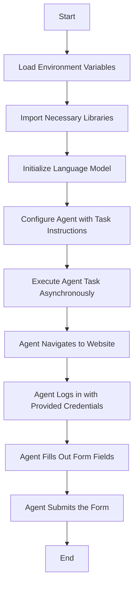
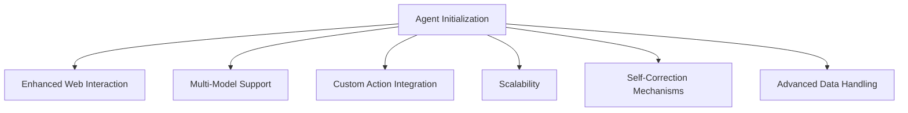

# Technical Overview of Browser Automation Using `browser_use`

## Introduction

The provided Python script demonstrates the use of the `browser_use` library in conjunction with the `langchain_openai` and `langchain_anthropic` libraries to automate interactions with a web application. Specifically, it automates the process of navigating to a Single Page Application (SPA) built with Remix, logging in with specified credentials, filling out a form, and submitting it.

## Q1: Technical Breakdown of Implementation

### Components Involved

1. **`browser_use` Library**: An open-source web automation library that enables AI agents to interact with websites, supporting various language models (LLMs) .

2. **`langchain_openai` and `langchain_anthropic` Libraries**: These provide interfaces to OpenAI's and Anthropic's language models, respectively, facilitating natural language processing capabilities.

3. **`mindwell-form-app`**: A Single Page Application (SPA) built with Remix, utilizing Aurora DB, and hosted on Vercel.

### Workflow Breakdown

1. **Environment Setup**:
   - **API Keys**: The `.env` file stores API keys for OpenAI and Anthropic services, ensuring secure access.
   - **Library Imports**: Necessary modules are imported, including `Agent`, `Controller`, and `Browser` from `browser_use`, and `ChatOpenAI` from `langchain_openai`.

2. **Language Model Initialization**:
   - An instance of `ChatAnthropic` is created with specific parameters (e.g., model name, timeout, temperature) to handle natural language understanding and generation.

3. **Agent Configuration**:
   - An `Agent` instance is initialized with a detailed task description outlining the steps to be performed, such as navigating to the website, logging in, filling out the form, and submitting it.

4. **Asynchronous Execution**:
   - The `main` function asynchronously runs the agent's task using `asyncio.run(main())`, allowing for non-blocking execution.

### Detailed Flowchart

## Q2: Prompting Mechanism and Future Capabilities

### Prompting Mechanism

The agent is prompted through a structured task description provided during its initialization. This task description is a multi-step instruction set that guides the agent's actions sequentially. The language model interprets these instructions and generates the necessary commands to interact with the web application accordingly.

### Future Capabilities

When fully developed, this automation setup can offer the following capabilities:

1. **Enhanced Web Interaction**: Ability to interact with complex web applications, including handling dynamic content and multi-step workflows.

2. **Multi-Model Support**: Flexibility to integrate various language models, allowing for tailored natural language understanding and generation based on specific requirements.

3. **Custom Action Integration**: Support for defining custom actions, enabling the agent to perform specialized tasks such as data extraction, file manipulation, or API interactions.

4. **Scalability**: Capability to manage multiple agents concurrently, each operating in isolated browser contexts, facilitating large-scale automation tasks.

5. **Self-Correction Mechanisms**: Implementation of self-correcting behaviors where the agent can detect and rectify errors during execution, enhancing reliability.

6. **Advanced Data Handling**: Proficiency in extracting, processing, and storing data from web interactions, supporting complex data workflows and integrations.

### Future Capabilities Flowchart

## Conclusion

The integration of `browser_use` with language models like those from OpenAI and Anthropic provides a robust framework for automating web interactions. The current implementation showcases a structured approach to automating form submissions, and with further development, it holds the potential to support a wide array of complex automation tasks, enhancing operational efficiency and scalability.
