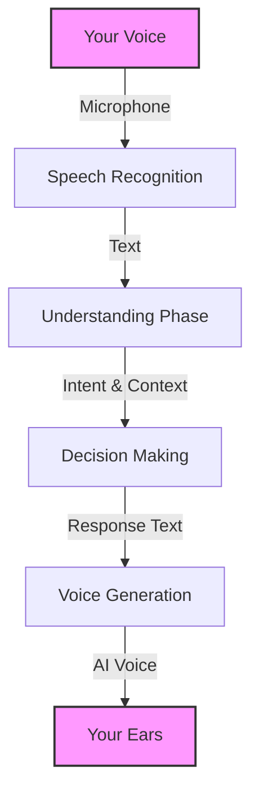
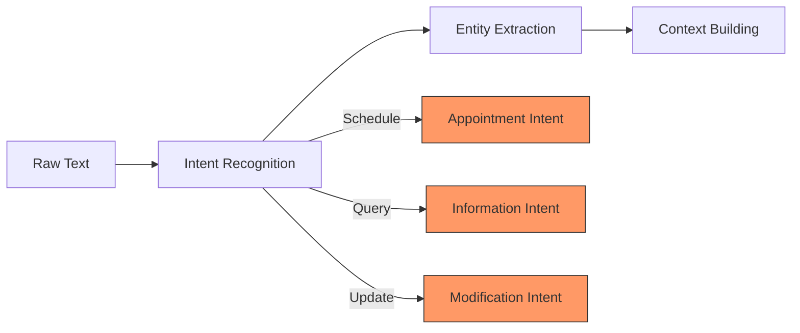
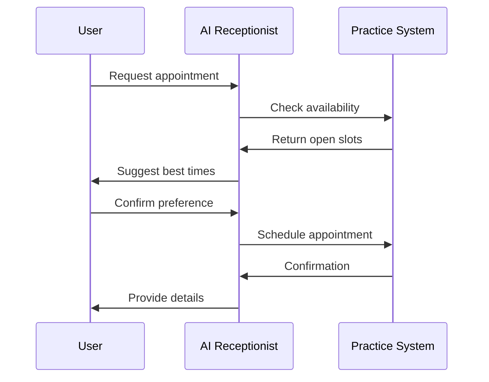
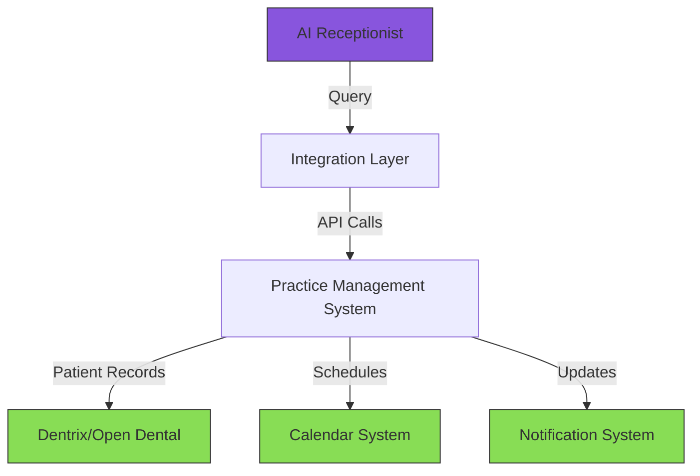

# Understanding Conversational AI: A Technical Deep Dive

## Introduction

Picture walking into a dental office and being greeted by a warm, professional voice that can schedule your appointments, answer your questions, and ensure all your information is properly recorded - but this voice belongs to an AI. This is exactly what we've built with the DCC AI Receptionist, and in this document, we'll break down how this technology works, exploring every component that makes this seamless interaction possible.

## The Magic Behind the Conversation

At its core, conversational AI is like an intricate dance between multiple technologies working in perfect harmony. When you speak to our AI receptionist, here's what happens behind the scenes:



### 1. Speech Recognition (The Listener)

When you speak to the AI receptionist, your voice is captured and processed in real-time. This isn't just simple recording - it's an sophisticated process of converting sound waves into digital data that can be understood by computers. We use ElevenLabs' advanced speech recognition system, which has been trained on millions of hours of human speech to understand various accents, handle background noise, and maintain context through entire conversations.

The speech recognition system works by:
- Breaking down your speech into tiny fragments (usually 20ms chunks)
- Analyzing the acoustic patterns in each chunk
- Converting these patterns into probable words and phrases
- Using context to improve accuracy (e.g., knowing medical terms in a dental context)

### 2. Understanding Phase (The Interpreter)

Once your speech has been converted to text, the system needs to understand what you actually mean. This is where Natural Language Processing (NLP) comes into play. Let's look at how this works:



For example, when you say "I need to schedule a cleaning next week," the system:
1. Identifies the intent (scheduling)
2. Extracts key information (service type: cleaning, timeframe: next week)
3. Maintains context for follow-up questions

### 3. The Brain of the Operation

This is where the AI receptionist truly shines. Using a sophisticated decision-making system, it:

1. **Processes Information**:
   - Verifies available appointment slots in real-time
   - Checks doctor schedules and specialties
   - Reviews patient history and preferences

2. **Makes Decisions**:
   - Determines the best appointment options
   - Decides if a specialist is needed
   - Identifies if human intervention is required



### 4. Voice Generation (The Speaker)

The final piece of the puzzle is converting the AI's response back into natural-sounding speech. This is achieved through ElevenLabs' state-of-the-art voice synthesis technology. Unlike traditional robotic-sounding text-to-speech systems, our AI receptionist uses neural voice generation to create warm, natural-sounding responses that maintain consistent tone and personality throughout the conversation.

## Integration with Dental Practice Systems

One of the most powerful aspects of our AI receptionist is its ability to integrate seamlessly with existing dental practice management systems. Let's look at how this works:

### Real-time Database Interaction



The system maintains real-time synchronization with your practice management software, enabling it to:
- Access up-to-date scheduling information
- Verify patient records instantly
- Update appointments in real-time
- Send confirmations and reminders
- Maintain HIPAA compliance throughout

## The ElevenLabs Advantage

Our implementation leverages ElevenLabs' cutting-edge API suite, which provides:

1. **Speech Recognition API**
   - Real-time processing with minimal latency
   - High accuracy across accents and dialects
   - Noise-resistant processing
   - Context-aware interpretation

2. **Voice Generation API**
   - Natural, human-like speech synthesis
   - Consistent voice personality
   - Emotion and intonation control
   - Multiple voice options

3. **WebSocket Communication**
   For real-time, bi-directional audio streaming:
   ```javascript
   const conversation = useConversation({
     onConnect: () => console.log("Connected"),
     onMessage: (message) => handleMessage(message),
     onDisconnect: () => handleDisconnect()
   });
   ```

## Real-world Application: DCC AI Receptionist

Let's walk through a typical interaction to see how all these components work together:

1. **Initial Greeting**:
   - System detects incoming call
   - Activates appropriate voice model
   - Initiates welcoming conversation

2. **Appointment Scheduling**:
   - Processes natural language request
   - Accesses scheduling database
   - Suggests available times
   - Handles negotiations and preferences

3. **Confirmation and Follow-up**:
   - Books confirmed appointment
   - Sends confirmation details
   - Updates practice management system
   - Schedules follow-up reminders

## Future Possibilities

The technology behind conversational AI is evolving rapidly, and we're excited about upcoming possibilities:

1. **Enhanced Personalization**
   - Learning patient preferences over time
   - Adapting communication style
   - Predictive scheduling suggestions

2. **Expanded Capabilities**
   - Insurance verification integration
   - Multi-language support
   - Advanced medical history processing
   - Emergency situation handling

3. **Improved Integration**
   - Direct insurance company connections
   - Integrated payment processing
   - Cross-platform synchronization

## Technical Considerations

### Security and Compliance

Security is paramount in healthcare settings. Our system maintains:
- End-to-end encryption for all communications
- HIPAA-compliant data handling
- Secure database interactions
- Regular security audits and updates

### Scalability

The system is designed to handle growth:
- Cloud-based infrastructure
- Load balancing capabilities
- Automatic scaling based on demand
- Redundancy and failover systems

## Conclusion

Conversational AI represents a significant leap forward in patient interaction and practice management. By combining cutting-edge technologies with practical healthcare requirements, we've created a system that not only works efficiently but enhances the overall patient experience.

Remember, the AI receptionist isn't meant to replace human staff but to augment their capabilities, handling routine tasks while allowing your team to focus on more complex, personal interactions with patients.

---

*For specific implementation details, custom requirements, or a demonstration of the system, please contact our development team at [hello@haloweave.com](mailto:hello@haloweave.com)*