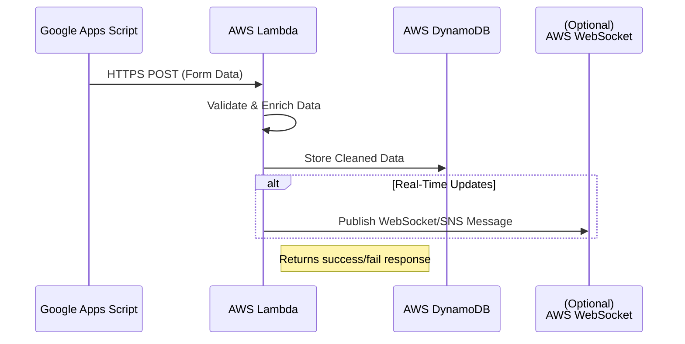
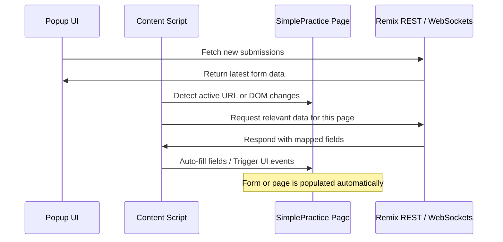
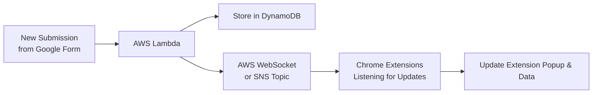

# Automated Client Onboarding & Processes for SimplePractice

This document details a technical pipeline using Google Forms, Google Apps Script, AWS services, and a Chrome extension to automate client onboarding and other repetitive tasks within SimplePractice.

## Table of Contents
1. [Overview](#overview)
2. [Features & Problems Solved](#features--problems-solved)
3. [System Capabilities](#system-capabilities)
4. [Tech Stack](#tech-stack)
5. [Flowcharts](#flowcharts)
   - [Overall Pipeline](#overall-pipeline)
   - [Webhook Processing](#webhook-processing)
   - [Remix Dashboard & APIs](#remix-dashboard--apis)
   - [Chrome Extension Flow](#chrome-extension-flow)
   - [Real-Time Updates](#real-time-updates)
6. [Maintenance Costs](#maintenance-costs)
7. [Conclusion](#conclusion)

## Overview
This system automates data collection from Google Forms and efficiently feeds this data into SimplePractice. It combines multiple AWS services with a Chrome extension to coordinate data flows, validate submissions, and provide real-time updates.

Key highlights include:

- Real-Time Form Capture: Google Apps Script triggers on form submission, instantly sending data to AWS Lambda for processing
- Data Storage & Processing: AWS Lambda, DynamoDB, and AWS API Gateway for WebSocket push notifications
- Dashboard & API: A Remix Single Page Application (SPA) hosted on AWS (CloudFront or Elastic Beanstalk + S3) provides a central interface to monitor and manage submissions
- Chrome Extension: Detects pages in SimplePractice, automates data entry, and offers admin users quick access to the latest form submissions

## Features & Problems Solved
1. Elimination of Manual Data Entry
   - Automatically pulls Google Form submissions into SimplePractice
   - Reduces errors and speeds up the onboarding process

2. Centralized Dashboard
   - Provides a Remix-based UI to view, search, and analyze client submissions
   - Enables filtering and analytics for forms of various use cases

3. Real-Time Notifications
   - Immediately alerts admins (via the Chrome extension or the dashboard) when new submissions arrive

4. Extensible Automation Rules
   - Supports multiple Google Forms with configurable mapping to SimplePractice fields
   - Eases the burden of repetitive tasks by allowing dynamic UI interactions on the SimplePractice pages

## System Capabilities
1. Multiple Form Support: Admins can define separate mappings for each Google Form, enabling unique automation flows

2. Immediate Trigger on Submission: Google Apps Script calls a webhook, ensuring form data is processed within seconds

3. Validations & Enrichment: AWS Lambda can validate form data, check required fields, and enrich data before storage

4. Scalable & Resilient:
   - AWS DynamoDB for NoSQL data storage, handling variable loads with high availability
   - AWS Lambda for serverless compute, minimizing idle infrastructure costs

5. Chrome Extension Interaction:
   - Dynamically recognizes SimplePractice pages
   - Automates field population and step-by-step actions
   - Displays a convenient popup to list incoming submissions

6. Remix Dashboard:
   - Presents a summary of all submissions, with options to search, filter, and tag
   - Allows admins to manage automation rules, user roles, and bulk operations

## Tech Stack

| Component | Technology | Purpose |
|-----------|------------|----------|
| Form Submission | Google Forms + Apps Script | Real-time data submission and webhook trigger |
| Webhook | AWS Lambda + API Gateway (REST) | Receive data, apply validation/enrichment |
| Database | AWS DynamoDB | Store structured submissions and mapping configurations |
| SPA | Remix + AWS (CloudFront/S3 or EB) | Dashboard, API routes, and business logic |
| Real-Time Updates | AWS API Gateway (WebSockets) | Notify Chrome extensions dynamically of new submissions |
| Chrome Extension | Vanilla JS/React | Automate data entry and UI interactions in SimplePractice |

## Flowcharts

Below are Mermaid-based flowcharts detailing the key processes in this pipeline.

### Overall Pipeline
```mermaid
flowchart LR
    A[Client fills Google Form] --> B[Apps Script Trigger]
    B --> C[AWS Lambda - Webhook Endpoint]
    C --> D[DynamoDB - Store Structured Data]
    D --> E[Remix SPA Dashboard<br>(AWS CloudFront / S3)]
    D --> F[Chrome Extension]
    C --> G[Real-Time Notification via<br>WebSockets / SNS (Optional)]
    G --> F
    F -->|On SimplePractice pages| H[Automated Data Entry]
```

Description:
1. A user submits data via Google Forms
2. Google Apps Script triggers on submission and pushes data to the AWS Lambda endpoint
3. Lambda processes and stores data in DynamoDB
4. The Remix SPA fetches from DynamoDB to display in the dashboard
5. The Chrome extension can retrieve new data from the database or via real-time notifications
6. When the extension detects the correct page on SimplePractice, it automates field entries and other tasks

### Webhook Processing


Description:
1. Google Apps Script sends a webhook request (HTTPS POST) to AWS Lambda
2. Lambda performs any necessary validations or data transformations
3. The structured data is stored in DynamoDB
4. If real-time updates are enabled, Lambda notifies connected clients via WebSocket or SNS

### Remix Dashboard & APIs
```mermaid
flowchart LR
    A[Admin Logs In<br>(Remix SPA)] --> B[Dashboard UI<br>(Browser)]
    B --> C[Remix Server Routes]
    C --> D[DynamoDB]
    C --> E[Automation Config Mappings]
    D --> B
    E --> B
```

Description:
1. An admin logs into the Remix dashboard
2. The dashboard queries a Remix server route for submission data
3. The server route fetches data from DynamoDB
4. Mappings and automation rules are also stored in DynamoDB (or a separate table in the same DB)
5. The response is returned to the dashboard for display

### Chrome Extension Flow


Description:
1. The Popup UI fetches the latest submissions from the Remix API
2. The Content Script monitors the user's current page in SimplePractice
3. When a recognized page is detected, it requests the relevant data (based on form ID, mappings, etc.) from the Remix API
4. The extension automatically populates fields in SimplePractice, eliminating tedious manual data entry

### Real-Time Updates


Description:
1. A new submission triggers AWS Lambda
2. Lambda stores the data in DynamoDB
3. Lambda sends a message via AWS WebSocket or an SNS Topic
4. Connected Chrome extensions receive the update
5. The extension updates its UI automatically, showing new submissions in near real-time

## Maintenance Costs
Below is an approximate breakdown of the monthly costs for a small-to-medium-scale deployment:

1. AWS Lambda
   - Free Tier: 1 million requests/month & 400,000 GB-seconds of compute time
   - Estimated: Under $10/month for moderate usage beyond the free tier

2. AWS DynamoDB
   - Free Tier: 25 GB of storage and 25 RCU / 25 WCU
   - Estimated: Under $5/month for small traffic and minimal storage

3. API Gateway (REST/WebSocket)
   - Free Tier: 1 million REST API calls
   - Estimated: Under $10/month for additional calls or WebSocket connections

4. AWS CloudFront + S3
   - Free Tier: 50 GB data transfer out and 2 million HTTP/HTTPS requests
   - Estimated: $10–$20/month, depending on data usage and traffic

5. Other
   - Google Forms & Apps Script: Free (with standard Google Workspace usage)

By leveraging serverless architecture and AWS Free Tier, this solution scales affordably with usage.

## Conclusion
This pipeline provides a robust, end-to-end system for automating onboarding and other tasks in SimplePractice. By centralizing Google Form data, applying configurable mappings in AWS, and using a Chrome extension for real-time page automation, we eliminate manual effort and reduce errors. The suggested architecture is scalable, cost-effective, and easily adaptable to new use cases.