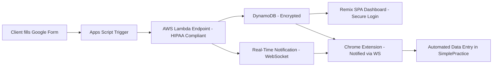

# Automated Client Onboarding & Processes for SimplePractice (Revised for HIPAA & Local Storage Options)

This document revisits our technical pipeline for automating client onboarding within SimplePractice. It addresses key concerns around HIPAA compliance and explores alternative data-flow architectures that minimize external data storage by leveraging Chrome's local storage.

> **Important Note**  
> The flow described here must be carefully vetted for HIPAA compliance. If Protected Health Information (PHI) or any Personally Identifiable Information (PII) is being processed or stored, ensure that:
> 1. All relevant services (e.g., AWS) have a Business Associate Agreement (BAA) in place.  
> 2. Proper encryption, access controls, and compliance best practices are enforced.

## Table of Contents
1. [Overview](#overview)
2. [Key Concerns & Solutions](#key-concerns--solutions)
   - [1. HIPAA Compliance](#1-hipaa-compliance)
   - [2. Local Storage for Reduced External Exposure](#2-local-storage-for-reduced-external-exposure)
   - [3. AI Assistance in the Extension](#3-ai-assistance-in-the-extension)
3. [Proposed Architecture](#proposed-architecture)
   - [Option A: HIPAA-Compliant AWS Storage](#option-a-hipaa-compliant-aws-storage)
   - [Option B: Local Storage-Heavy Approach](#option-b-local-storage-heavy-approach)
4. [Flowcharts](#flowcharts)
   - [Overall Pipeline (Option A)](#overall-pipeline-option-a)
   - [Local Storage-Heavy Pipeline (Option B)](#local-storage-heavy-pipeline-option-b)
5. [Maintenance & Compliance Costs](#maintenance--compliance-costs)
6. [Edge Cases & Considerations](#edge-cases--considerations)
7. [Conclusion](#conclusion)

---

## Overview
We aim to automate data collection from Google Forms and feed it into SimplePractice. Traditionally, we relied on AWS Lambda and DynamoDB to store submissions and push them to the Chrome extension in real time. However, new concerns around HIPAA compliance and data storage prompt us to explore alternative flows that reduce or eliminate the need for storing PHI in the cloud.

This revised plan considers two main approaches:

1. **Option A:** Using HIPAA-compliant AWS services (with a BAA) to safely store and process patient data.
2. **Option B:** Storing minimal data in the cloud—or none at all—and instead using Chrome's Local Storage and ephemeral data flows to keep PHI off external servers.

Both approaches maintain a similar user experience (automatic data entry in SimplePractice, real-time notifications, centralized or local dashboards), but differ in how data is handled and stored to mitigate compliance risks.

---

## Key Concerns & Solutions

### 1. HIPAA Compliance
- **Concern**: Storing patient data (PHI) in AWS DynamoDB might require strict HIPAA controls and a signed BAA with AWS.
- **Solution**:  
  1. **Sign a BAA with AWS**: If patient data must reside in AWS, ensure all relevant services are covered under AWS's HIPAA compliance program.  
  2. **Encrypt Data at Rest and In Transit**: Use server-side or client-side encryption for DynamoDB, and enforce HTTPS/TLS 1.2+ for all data transmissions.  
  3. **Limit Data Storage**: Only store the minimum necessary patient data (e.g., unique identifier) in the cloud; optionally, keep full PHI in the user's local storage or a secure environment.  

### 2. Local Storage for Reduced External Exposure
- **Concern**: Even with a BAA in place, some organizations want to avoid placing any PHI in external servers. 
- **Solution**:  
  - **Local Storage-Heavy Workflow**: Form submissions can be routed directly from Google Apps Script to the user's Chrome extension via ephemeral API calls. PHI is stored or cached locally in the extension, which then handles the data entry into SimplePractice.  
  - **Ephemeral Transit**: Data only "touches" servers in transit (Google's built-in script execution) but isn't permanently stored outside the local environment.  
  - **Trade-offs**: Local storage is less robust for multi-user scenarios or real-time dashboards, but it significantly mitigates compliance risks.

### 3. AI Assistance in the Extension
- **Concern**: Can AI be integrated on the client side to handle complex business logic (e.g., matching patients to clinician availability) without exposing PHI to external services?
- **Solution**:  
  - **Local AI Models**: Use smaller client-side ML models or rule-based logic in the extension. The logic can operate on locally stored or ephemeral data.  
  - **Hybrid Approach**: For advanced AI algorithms requiring server-side compute, ensure the server is HIPAA-compliant or that no direct PHI is passed to the model (e.g., using de-identified data or references).  
  - **Permissions & Privacy**: Users must explicitly grant the extension permission to run AI tasks or access data.

---

## Proposed Architecture

### Option A: HIPAA-Compliant AWS Storage
1. **Google Forms + Apps Script**  
   - Triggers on form submission.  
   - Immediately sends data to an **AWS Lambda endpoint** over HTTPS/TLS.  
2. **AWS Lambda & DynamoDB (HIPAA-Compliant)**  
   - A BAA is in place with AWS.  
   - Data is encrypted at rest in DynamoDB, and all access is strictly controlled via IAM roles.  
3. **Remix Dashboard**  
   - Runs on AWS (e.g., CloudFront + S3) behind a secure login.  
   - Fetches submissions from DynamoDB, allowing admins to view or manage them.  
4. **Chrome Extension**  
   - Receives real-time updates via AWS WebSockets or polling.  
   - Automates field population in SimplePractice.  
5. **AI Integration**  
   - Either run lightweight AI logic in the extension or route requests to a secure, HIPAA-compliant AWS service (e.g., AWS SageMaker with a BAA in place).  

> **Key HIPAA Steps**  
> - Encrypt PHI in DynamoDB and S3.  
> - Use secure VPC, strong IAM policies.  
> - Sign BAAs with AWS.  
> - Maintain an audit log of data access within the Dashboard.

### Option B: Local Storage-Heavy Approach
1. **Google Forms + Apps Script**  
   - On form submission, **call a minimal webhook** or a direct "publish" function that notifies the **Chrome extension** (if online).  
   - Alternatively, the extension polls Google Sheets directly using the user's authenticated Google session (no data is stored in external DB).  
2. **Chrome Extension as Primary Data Store**  
   - The extension maintains a **local database** (e.g., `chrome.storage.local`) for all submission data.  
   - Optionally, data is only stored in memory (not persisted), reducing risk further.  
3. **On-Demand Data Retrieval**  
   - When the extension detects a user is on a SimplePractice page, it retrieves relevant patient data from its local store.  
   - **No or Minimal** data is stored externally.  
4. **AI Integration**  
   - The extension runs local or rule-based logic to match patients to clinicians, schedule appointments, or fill in forms.  
   - All computations happen locally, with no external calls containing PHI.  
5. **Dashboard**  
   - A simplified dashboard could exist locally within the extension's UI (limiting multi-user collaboration).  
   - If a multi-user web dashboard is required, only anonymized or minimal data is sent to a central server.  

> **Trade-Off**  
> - **Pros**: Drastically reduced exposure of PHI on external servers. Eases compliance concerns (fewer BAAs, less risk).  
> - **Cons**: Harder to share data among multiple admins; relies on each user's browser extension. No universal "source of truth" in the cloud.

---

## Flowcharts

### Overall Pipeline (Option A)



1. **Form**: Client or patient enters PHI in Google Forms.  
2. **Apps Script**: Immediately sends an HTTPS POST to AWS Lambda.  
3. **Lambda**: Validates, enriches, and encrypts data before storing in DynamoDB.  
4. **Dashboard**: Authorized admins access data for reporting or manual intervention.  
5. **Chrome Extension**: Monitors for new submissions and automates SimplePractice data entry.  

### Local Storage-Heavy Pipeline (Option B)

```mermaid
flowchart LR
    A[Client fills Google Form] --> B[Apps Script]
    B --(Minimal Notification)--> C[Chrome Extension <br>(Local Storage)]
    C --> D[Automated Data Entry <br> in SimplePractice]
    C --> E[Local AI Matching <br>(Optional)]
```

1. **Form**: Client or patient submits PHI.  
2. **Apps Script**: Either calls a lightweight webhook or uses the Google Sheets API to provide data to the extension. Minimal or no external DB is used.  
3. **Chrome Extension**: Stores the data locally (`chrome.storage.local`).  
4. **Extension**: Detects relevant SimplePractice pages and auto-fills forms.  
5. **(Optional) AI**: Runs local or rule-based algorithms for clinician matching, scheduling, etc.

---

## Maintenance & Compliance Costs

1. **Option A (AWS HIPAA Approach)**  
   - **AWS BAA**: You'll need a BAA with AWS covering Lambda, DynamoDB, S3, API Gateway, etc.  
   - **Cost**: Low to moderate if usage is modest (Lambda, DynamoDB, and API Gateway can be under $50/month). Additional cost for advanced AI services.  
   - **Compliance Overhead**: You must maintain HIPAA policies, procedures, encryption, and audits in your AWS environment.

2. **Option B (Local Storage)**  
   - **No Ongoing Cloud Storage**: Minimal costs for hosting a small webhook or potential static extension pages.  
   - **Cost**: Primarily limited to developer time for maintaining local data workflows.  
   - **Compliance Overhead**: The biggest concern is ensuring that local storage and transmission are secure, particularly if multiple users or devices need access.  
   - **Reliability**: The extension is reliant on the user's browser environment. Offline scenarios or multi-user consistency can be challenging.

---

## Edge Cases & Considerations
1. **Multiple Admins / Multi-User Collaboration**  
   - **Option A** has a centralized database; easy for multiple admins to view data.  
   - **Option B** makes collaboration trickier (data is local to each user's browser unless carefully shared).
2. **Offline or Intermittent Connectivity**  
   - Local storage can keep data accessible even if offline, but real-time sync becomes complex.  
3. **Extension Unavailability**  
   - If the Chrome extension isn't installed or is disabled, auto-entry fails. A fallback manual process is recommended.  
4. **Data Retention & Deletion**  
   - HIPAA requires secure retention and disposal of PHI. In Option B, local storage data must be cleared or purged regularly.  
5. **Automated AI Decision-Making**  
   - Ensure no PHI is sent to non-compliant external AI services. Strictly manage any external calls.  
6. **Updates to Form Fields**  
   - Changes in Google Forms or SimplePractice fields require updates to the extension's mapping logic. This can be easier with a central dashboard (Option A) vs. local configuration (Option B).

---

## Conclusion
This revised plan addresses critical compliance issues by offering two primary approaches:

1. **Option A (HIPAA-Compliant Cloud)**: Uses AWS (with a BAA), centralized storage, and a Remix dashboard for robust multi-user functionality. This requires strict HIPAA measures—encryption, least-privilege IAM policies, and an audit trail.

2. **Option B (Local Storage)**: Minimizes data exposure by avoiding persistent cloud storage of PHI. The Chrome extension handles data end-to-end, storing or caching submissions locally. This significantly reduces the compliance risk surface area but limits collaborative features.

Both approaches can be enhanced with **client-side AI** for tasks like matching clinicians to patient availability—so long as any external AI service is also HIPAA-compliant or only de-identified data is used. The choice depends on organizational requirements for collaboration, real-time dashboards, and the tolerance for external data storage. Ultimately, robust security, encryption, and a well-documented HIPAA compliance strategy are essential to protect patient data and meet regulatory obligations.