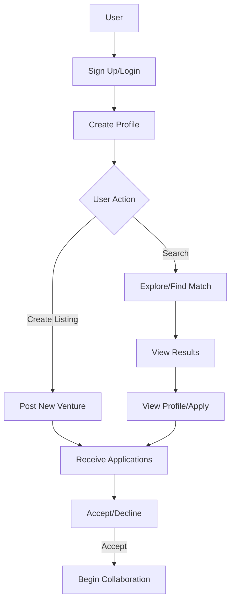
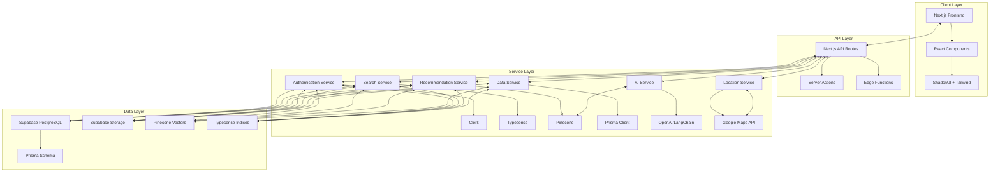
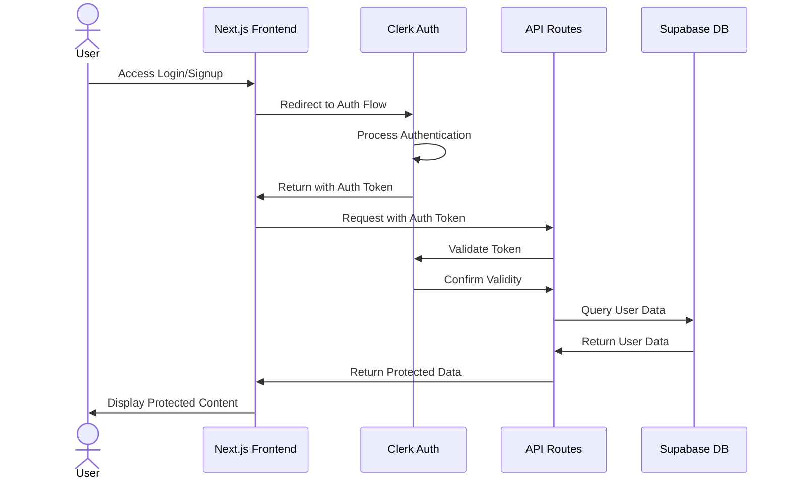
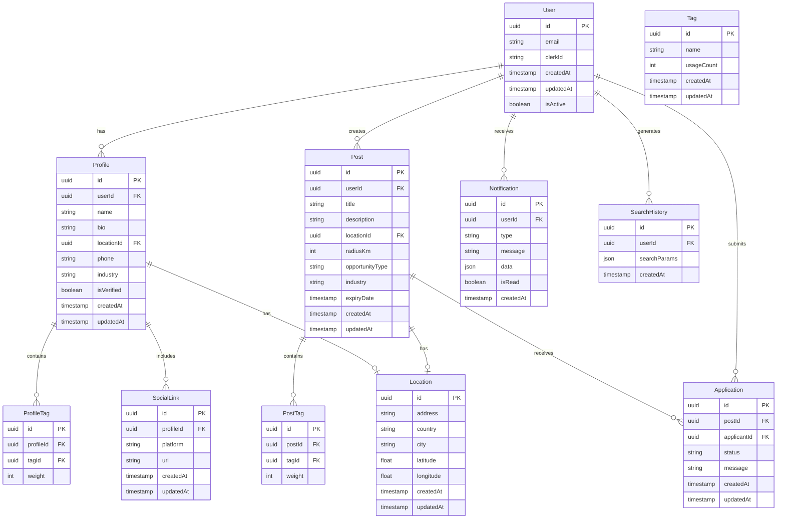
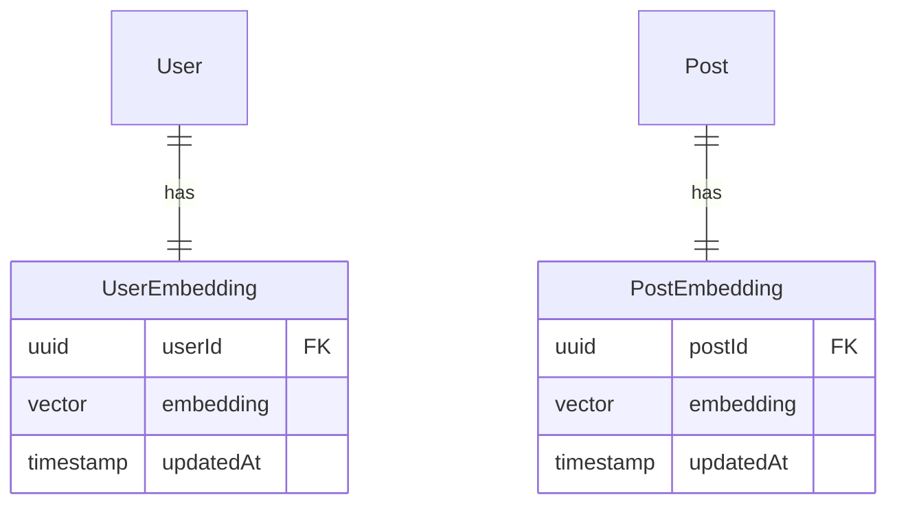
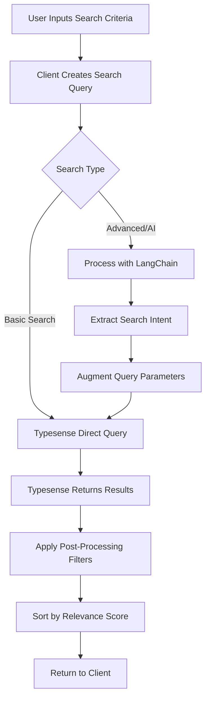
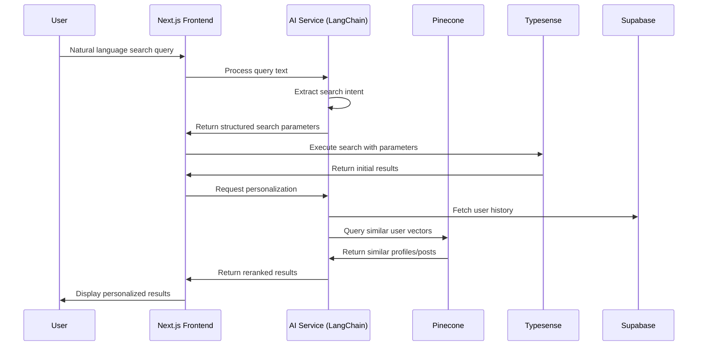
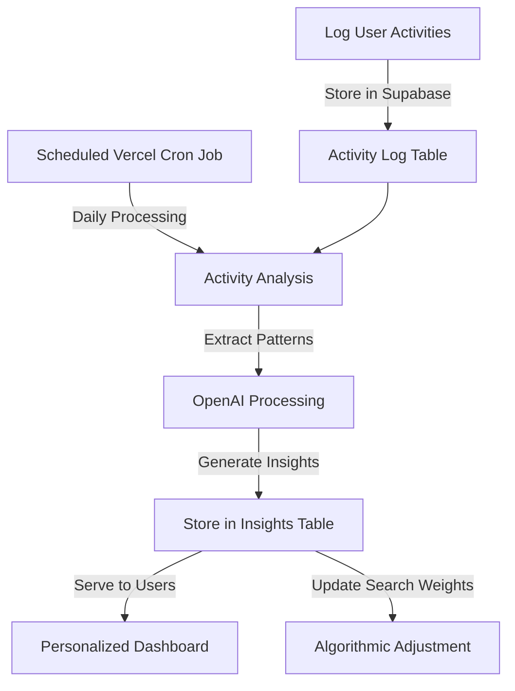
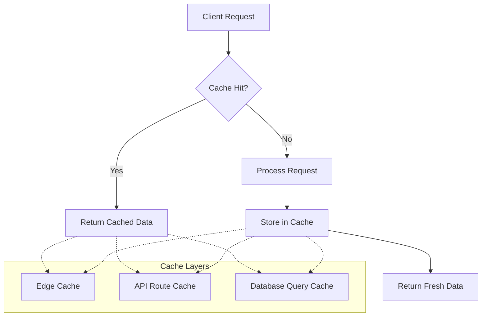

# Haloweave Technical Implementation Proposal for SponsorLink

## Executive Summary

This document outlines Haloweave's technical approach to implementing TruPersona's SponsorLink platform. SponsorLink is a professional collaboration network designed to match individuals, influencers, businesses, and brands for various collaborative ventures. Our implementation leverages modern web technologies and AI integration to create a scalable, efficient, and intelligent matching platform.

## 1. Understanding SponsorLink

### 1.1 Core Concept

SponsorLink is a professional community network built specifically for **collaboration matching**. The platform enables users to:
- Create detailed profiles with personal/business information, industry tags, and location data
- Search for potential collaborators using advanced filters
- Create venture listings that others can apply to
- Manage applications and communications through an integrated notification system
- Benefit from AI-enhanced matching and recommendations

At its essence, SponsorLink bridges the gap between those seeking collaboration and those offering skills or resources, with an emphasis on location-aware matching and intelligent recommendations.

### 1.2 Key User Journeys



## 2. Technical Architecture

### 2.1 Technology Stack Overview

Haloweave proposes implementing SponsorLink using the following modern technology stack:

| Component | Technology | Justification |
|-----------|------------|---------------|
| **Frontend Framework** | Next.js 14 | Server components for improved performance, built-in API routes, SEO optimization, and efficient rendering strategies |
| **UI Components** | Tailwind CSS + Shadcn UI | Flexible styling with pre-built accessible components for rapid development |
| **Database** | Supabase (PostgreSQL) | Relational database with real-time capabilities, robust querying, and built-in authentication systems |
| **ORM** | Prisma | Type-safe database access with auto-generated migrations and schema validation |
| **Authentication** | Clerk | Comprehensive authentication solutions with multi-provider support and security features |
| **Search** | Typesense | Open-source, typo-tolerant search engine with geospatial capabilities for location-based matching |
| **Vector Database** | Pinecone | Specialized vector database for semantic search and AI-powered recommendations |
| **Hosting/Deployment** | Vercel | Seamless deployment, edge functions, analytics, and monitoring tools |
| **AI Integration** | OpenAI API + LangChain | Natural language processing for search context understanding and data analysis |
| **Storage** | Supabase Storage | Object storage for profile images and collaboration assets |
| **Maps/Location** | Google Maps API | Geocoding, address validation, and distance calculations |

### 2.2 System Architecture



### 2.3 Authentication Flow



## 3. Database Schema

### 3.1 Core Entities



### 3.2 Vector Storage Schema



## 4. Implementation Details for Key Features

### 4.1 User Authentication and Profile Management

Clerk will handle the authentication flow, offering multiple sign-in methods (email/password, Google, etc.). The implementation will:

1. **Setup Clerk Provider** at the application root
2. **Create middleware** to protect routes and validate session tokens
3. **Implement sign-up flow** with custom fields:
   - Personal information (name, email, etc.)
   - Profile details (industry, bio)
   - Location data (using Google Maps API for geocoding)
   - Tags selection/creation interface

```typescript
// Prisma transaction example for profile creation
async function createUserProfile(
  userId: string,
  profileData: ProfileInput,
  tagIds: string[],
  socialLinks: SocialLinkInput[]
) {
  return await prisma.$transaction(async (tx) => {
    // Create or find location
    const location = await tx.location.upsert({
      where: { address: profileData.address },
      update: {},
      create: {
        address: profileData.address,
        country: profileData.country,
        city: profileData.city,
        latitude: profileData.latitude,
        longitude: profileData.longitude,
      },
    });

    // Create profile
    const profile = await tx.profile.create({
      data: {
        userId,
        name: profileData.name,
        bio: profileData.bio,
        industry: profileData.industry,
        locationId: location.id,
        phone: profileData.phone,
      },
    });

    // Create profile tags with weights
    for (const tagId of tagIds) {
      await tx.profileTag.create({
        data: {
          profileId: profile.id,
          tagId,
          weight: 100, // Default weight
        },
      });
    }

    // Create social links
    for (const link of socialLinks) {
      await tx.socialLink.create({
        data: {
          profileId: profile.id,
          platform: link.platform,
          url: link.url,
        },
      });
    }

    return profile;
  });
}
```

### 4.2 Explore/Find a Match Feature

The match finding system will leverage Typesense for fast, typo-tolerant searching combined with geospatial queries:

1. **Index Creation** in Typesense for profiles and posts
2. **Advanced Search Form** with real-time results using React Hook Form
3. **Geospatial Filtering** using latitude/longitude to calculate distances



Typesense configuration for the Posts collection:

```typescript
const postsSchema = {
  name: 'posts',
  fields: [
    { name: 'id', type: 'string' },
    { name: 'title', type: 'string' },
    { name: 'description', type: 'string' },
    { name: 'opportunityType', type: 'string', facet: true },
    { name: 'industry', type: 'string', facet: true },
    { name: 'tags', type: 'string[]', facet: true },
    { name: 'location', type: 'geopoint' },
    { name: 'userId', type: 'string' },
    { name: 'expiryDate', type: 'int64' },
    { name: 'createdAt', type: 'int64', sort: true }
  ],
  default_sorting_field: 'createdAt'
};
```

### 4.3 AI-Enhanced Search and Recommendations

The AI integration will use OpenAI's API and LangChain to provide:

1. **Contextual Search Understanding** - Parse natural language queries
2. **User Behavior Analysis** - Identify patterns in user interactions
3. **Recommendation Generation** - Suggest relevant matches



### 4.4 Post Creation and Management

The post creation system will:

1. **Implement form with dynamic tag selection**
2. **Store post data** in Supabase via Prisma
3. **Create searchable index** in Typesense
4. **Generate vector embedding** for semantic search in Pinecone

```typescript
// Edge function for post creation with embedding generation
export async function createPost(formData: FormData) {
  const session = await getSession();
  if (!session?.user) throw new Error('Unauthorized');

  const postData = parseFormData(formData);
  
  // Create post in database
  const post = await prisma.post.create({
    data: {
      userId: session.user.id,
      title: postData.title,
      description: postData.description,
      opportunityType: postData.opportunityType,
      industry: postData.industry,
      expiryDate: new Date(postData.expiryDate),
      location: {
        create: {
          address: postData.address,
          country: postData.country,
          latitude: postData.latitude,
          longitude: postData.longitude,
        }
      },
      tags: {
        create: postData.tagIds.map(tagId => ({
          tag: { connect: { id: tagId } },
          weight: 100
        }))
      }
    },
    include: {
      location: true,
      tags: { include: { tag: true } }
    }
  });
  
  // Generate embedding for the post
  const embedding = await generatePostEmbedding(post);
  
  // Store in Pinecone
  await pineconeClient.upsert({
    namespace: 'posts',
    vectors: [{
      id: post.id,
      values: embedding,
      metadata: {
        title: post.title,
        userId: post.userId,
        industry: post.industry,
        opportunityType: post.opportunityType,
        latitude: post.location.latitude,
        longitude: post.location.longitude,
        tags: post.tags.map(t => t.tag.name)
      }
    }]
  });
  
  // Index in Typesense
  await typesenseClient.collections('posts').documents().create({
    id: post.id,
    title: post.title,
    description: post.description,
    opportunityType: post.opportunityType,
    industry: post.industry,
    tags: post.tags.map(t => t.tag.name),
    location: `${post.location.latitude},${post.location.longitude}`,
    userId: post.userId,
    expiryDate: Math.floor(post.expiryDate.getTime() / 1000),
    createdAt: Math.floor(post.createdAt.getTime() / 1000)
  });
  
  return post;
}
```

### 4.5 Notification System

The notification system will leverage Supabase's real-time capabilities:

1. **Create notification records** in Supabase
2. **Subscribe to real-time changes** using Supabase's subscription API
3. **Implement notification UI** with unread counts and notification center

```typescript
// Client-side notification subscription
function useNotifications() {
  const [notifications, setNotifications] = useState([]);
  const [unreadCount, setUnreadCount] = useState(0);
  const { user } = useAuth();
  
  useEffect(() => {
    if (!user) return;
    
    // Fetch existing notifications
    const fetchNotifications = async () => {
      const { data } = await supabase
        .from('notifications')
        .select('*')
        .eq('userId', user.id)
        .order('createdAt', { ascending: false })
        .limit(20);
      
      setNotifications(data || []);
      setUnreadCount(data.filter(n => !n.isRead).length);
    };
    
    fetchNotifications();
    
    // Subscribe to new notifications
    const subscription = supabase
      .channel('public:notifications')
      .on('postgres_changes', 
        { event: 'INSERT', schema: 'public', table: 'notifications', filter: `userId=eq.${user.id}` },
        (payload) => {
          setNotifications(prev => [payload.new, ...prev]);
          setUnreadCount(prev => prev + 1);
        }
      )
      .subscribe();
      
    return () => {
      subscription.unsubscribe();
    };
  }, [user]);
  
  return { notifications, unreadCount, markAsRead };
}
```

## 5. AI Enhancement Implementation

### 5.1 Trend and User Habit Analysis



Implementation steps:

1. **Track user interactions** with search, posts, and applications
2. **Batch process logs** using Vercel Cron to analyze patterns
3. **Generate insights** using OpenAI's API to detect trends
4. **Surface recommendations** to users based on these insights

### 5.2 Contextual Search Implementation

```typescript
// Example of AI-enhanced search processing
async function processNaturalLanguageSearch(query: string, userId: string) {
  // Get user context from database
  const userProfile = await prisma.profile.findUnique({
    where: { userId },
    include: { tags: { include: { tag: true } } }
  });
  
  // Process with LangChain
  const llm = new OpenAI({ temperature: 0 });
  const chain = PromptTemplate.fromTemplate(
    `Given the search query: "{query}" 
     and user interests: {interests}
     Extract the following parameters:
     - Industry (if mentioned)
     - Opportunity type (if mentioned)
     - Tags/skills (if mentioned)
     - Location context (if mentioned)
     - Radius preference (if mentioned)`
  ).pipe(llm).pipe(StructuredOutputParser.fromZodSchema(searchParamsSchema));
  
  // Execute the chain
  const searchParams = await chain.invoke({
    query,
    interests: userProfile.tags.map(t => t.tag.name).join(", ")
  });
  
  // Augment with user location if not specified in search
  if (!searchParams.location && userProfile.locationId) {
    const userLocation = await prisma.location.findUnique({
      where: { id: userProfile.locationId }
    });
    searchParams.location = userLocation;
  }
  
  return searchParams;
}
```

## 6. Scalability and Performance Strategy

### 6.1 Database Indexing Strategy

Key indexes will be created on:
- Post and profile table for frequent query patterns
- Geospatial indexes for location-based queries
- Tags for efficient filtering

### 6.2 Edge Function Deployment

Location-sensitive operations will be deployed to edge functions to:
- Reduce latency for distance calculations
- Provide regional compliance for data regulations
- Improve response times for search operations

### 6.3 Caching Strategy



Implementation:
- Next.js built-in caching for static assets
- SWR for client-side data fetching with stale-while-revalidate
- Redis caching for frequent database queries

## 7. Conclusion

Haloweave's implementation of SponsorLink leverages cutting-edge technologies to create a modern, scalable, and intelligent collaboration platform. By utilizing Next.js, Supabase, Prisma, Clerk, Typesense, and Pinecone, we can deliver a robust system that meets all the requirements while adding significant value through AI enhancements.

Our approach focuses on:
1. **Performance** - Fast loading, efficient searches, and responsive UI
2. **Scalability** - Architecture that can grow with user base
3. **Intelligence** - AI-driven features that improve over time
4. **User Experience** - Intuitive interfaces and seamless interactions

We are confident that this implementation will position SponsorLink as a leading platform in the collaboration space, providing users with an exceptional tool for finding and engaging with potential collaborators.