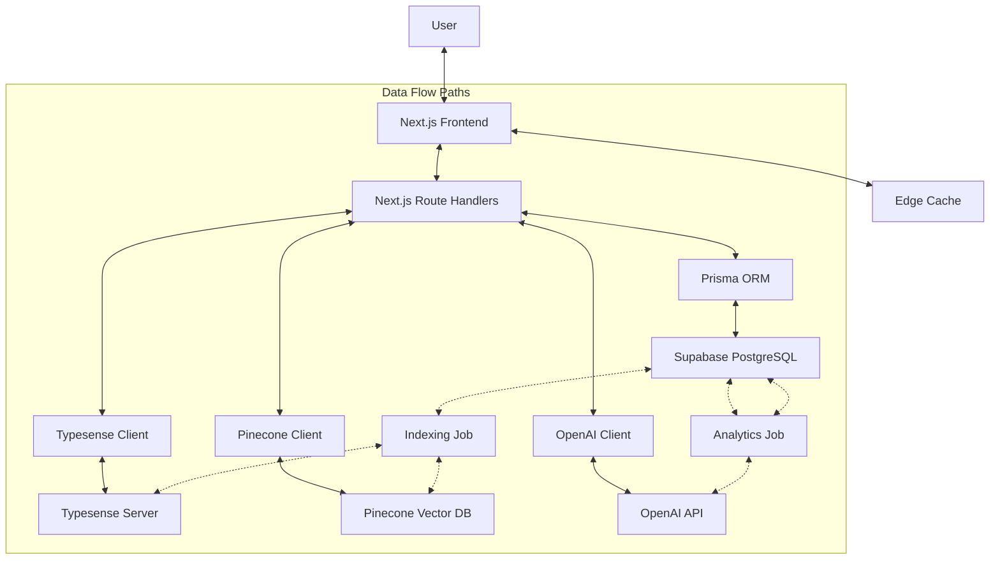

# SponsorLink Technical Architecture: Questions & Answers

## Vector Database & Semantic Search

### Q: Why is a vector database (Pinecone) used in the SponsorLink architecture?

**A:** Pinecone serves a crucial role in enabling AI-powered matching and recommendations in SponsorLink:

1. **Semantic similarity matching**: Unlike traditional databases that rely on exact keyword matching, vector databases store data as mathematical representations (vectors) that capture semantic meaning. This allows us to match users and posts based on conceptual similarity rather than just keyword overlap.

2. **High-dimensional search**: User profiles and posts contain multiple attributes (tags, industries, descriptions, etc.) that create high-dimensional data. Pinecone efficiently indexes and searches these high-dimensional vectors, which traditional databases struggle with.

3. **Scalable similarity search**: As SponsorLink grows, we'll need to perform thousands of similarity comparisons per second. Pinecone's architecture is optimized for this specific workload, providing sub-second query times even with millions of vectors.

4. **Integration with AI models**: We'll generate embeddings from user profiles and posts using pre-trained language models. These embeddings capture the semantic essence of the content, which Pinecone then stores and indexes, allowing us to find similar content without building custom machine learning infrastructure.

### Q: How does vector search improve matching compared to traditional search methods?

**A:** Vector search dramatically improves matching quality through:

1. **Understanding context**: Traditional search looks for exact keyword matches, missing contextual relationships. Vector search understands that "web developer" is related to "frontend engineer" even without exact term overlap.

2. **Handling synonyms and related concepts**: If a user searches for "marketing partnership," vector search can match posts about "brand collaboration" or "promotional alliance" based on semantic similarity.

3. **Multidimensional matching**: SponsorLink needs to match on multiple facets (skills, industry, location, opportunity type). Vector search can weigh these dimensions holistically rather than as separate filtering steps.

4. **Discovery of unexpected matches**: By focusing on conceptual similarity, vector search can surface relevant matches that users might not explicitly search for, increasing the platform's value in connecting collaborators who might otherwise miss each other.

5. **Personalization**: As users interact with the platform, their behavior can be encoded as vectors, enabling personalized recommendations based on interaction patterns without explicit rule creation.

### Q: What specific technical implementation details should we know about the vector search components?

**A:** The vector search implementation involves several key technical components:

```javascript
// Example: Generating an embedding for a user profile
async function generateProfileEmbedding(profile) {
  // Combine relevant profile data into a text representation
  const profileText = `
    ${profile.bio}
    Industry: ${profile.industry}
    Tags: ${profile.tags.map(t => t.tag.name).join(', ')}
  `;
  
  // Generate embedding using OpenAI's embedding API
  const response = await openai.embeddings.create({
    model: "text-embedding-3-small",
    input: profileText
  });
  
  return response.data[0].embedding;
}

// Example: Finding similar profiles using Pinecone
async function findSimilarProfiles(embedding, filter = {}, limit = 10) {
  const queryResult = await pineconeClient.query({
    namespace: 'profiles',
    vector: embedding,
    topK: limit,
    filter: filter, // Apply additional filters (e.g., by location)
    includeMetadata: true
  });
  
  return queryResult.matches.map(match => ({
    id: match.id,
    score: match.score,
    metadata: match.metadata
  }));
}
```

The implementation uses a 1536-dimensional vector space from OpenAI's embedding model, with vectors stored in separate Pinecone namespaces for users and posts. We update these embeddings whenever profiles or posts change, ensuring search results remain current.

## Search Engine Technology

### Q: Why use Typesense alongside Pinecone instead of just one search solution?

**A:** Typesense and Pinecone serve complementary roles in the SponsorLink architecture:

1. **Different search paradigms**: Typesense excels at structured, faceted, and typo-tolerant text search, while Pinecone handles semantic similarity and AI-powered recommendation.

2. **Performance optimization**: Typesense is optimized for low-latency filtering across multiple parameters (location, tags, industries) with exact matching, which is ideal for the initial exploration and filtering phase.

3. **Geospatial capabilities**: Typesense has built-in geospatial search features that make it perfect for location-based matching, allowing efficient filtering of results within a specific radius of a location.

4. **Cost efficiency**: Running all searches through vector similarity would be computationally expensive and unnecessary for basic filtering operations. Using Typesense for initial filtering before applying vector similarity creates a cost-effective, high-performance search architecture.

5. **Hybrid search approach**: We implement a hybrid search strategy where Typesense handles the filtering based on structured criteria, and Pinecone refines results based on semantic relevance, providing the best of both worlds.

```javascript
// Example of hybrid search implementation
async function hybridSearch(searchParams, userId) {
  // Step 1: Basic structured filtering with Typesense
  const initialResults = await typesenseClient.collections('posts').documents().search({
    q: searchParams.query || '',
    filter_by: buildFilterString(searchParams), // Convert params to Typesense filter syntax
    sort_by: '_text_match:desc',
    per_page: 100
  });
  
  // Step 2: If we have user context, enhance with vector similarity
  if (userId) {
    // Get user's embedding
    const userEmbedding = await getUserEmbedding(userId);
    
    // Get post IDs from initial results
    const postIds = initialResults.hits.map(hit => hit.document.id);
    
    // Rerank with vector similarity
    const vectorResults = await pineconeClient.query({
      namespace: 'posts',
      vector: userEmbedding,
      filter: { id: { $in: postIds } }, // Only consider posts from Typesense results
      topK: 20,
      includeMetadata: true
    });
    
    // Reorder based on vector similarity
    return reorderResults(initialResults.hits, vectorResults.matches);
  }
  
  return initialResults.hits;
}
```

### Q: How does Typesense specifically support SponsorLink's location-based matching requirements?

**A:** Typesense provides several key features that make it ideal for location-based matching:

1. **Built-in geosearch**: Typesense has native support for geospatial search, allowing queries like "find all posts within 50km of this location" without complex calculations in application code.

2. **Efficient filtering**: The platform can combine geographic constraints with other filters (tags, industries) in a single query with minimal latency.

3. **Customizable relevance**: We can adjust the weight of geographic proximity in search results, balancing distance against other matching factors.

4. **Performance at scale**: Typesense maintains performance even with millions of records and complex geo-queries, crucial for SponsorLink's growth plans.

Here's how we configure Typesense for geospatial search:

```javascript
// Typesense schema with geospatial field
const postsSchema = {
  name: 'posts',
  fields: [
    // Other fields...
    { 
      name: 'location', 
      type: 'geopoint' // Special field type for lat/lng coordinates
    },
    // More fields...
  ]
};

// Example search with location
const searchResults = await typesenseClient.collections('posts').documents().search({
  q: searchTerm,
  filter_by: `location:(${latitude}, ${longitude}, ${radiusInKm} km)`,
  sort_by: '_text_match:desc, location:(${latitude}, ${longitude}):asc`
});
```

## AI Integration & Implementation

### Q: How will Haloweave implement AI/Big Data for Trend and User Habit Analysis without building custom models?

**A:** We're taking a pragmatic approach to trend and user habit analysis by leveraging existing AI services:

1. **Event tracking infrastructure**: We'll implement a comprehensive event tracking system using Supabase that logs user interactions (searches, post views, applications, etc.) with associated metadata.

```javascript
// Example of event tracking
async function trackUserEvent(userId, eventType, metadata) {
  await supabase.from('user_events').insert({
    user_id: userId,
    event_type: eventType,
    metadata,
    created_at: new Date()
  });
}

// Usage
trackUserEvent(userId, 'post_view', { 
  postId, 
  source: 'search_results',
  query: searchQuery,
  position: resultPosition
});
```

2. **Aggregation with Vercel Edge Functions**: Scheduled Edge Functions will periodically aggregate this data into summary tables, identifying patterns like:
   - Most viewed industries by user segment
   - Trending tags (increasing in usage)
   - Regional collaboration patterns
   - Successful vs. unsuccessful collaboration markers

3. **Pattern analysis with OpenAI**: For complex pattern detection, we'll use OpenAI's API to analyze aggregated data:

```javascript
// Example: Detecting trends with OpenAI
async function analyzeTrends(aggregatedData) {
  const response = await openai.chat.completions.create({
    model: "gpt-4o",
    messages: [
      {
        role: "system",
        content: "Analyze the following user interaction data from a collaboration platform and identify the top 5 emerging trends."
      },
      {
        role: "user",
        content: JSON.stringify(aggregatedData)
      }
    ],
    response_format: { type: "json_object" }
  });
  
  return JSON.parse(response.choices[0].message.content);
}
```

4. **Real-time trend dashboard**: We'll create an admin dashboard displaying these trends, updated daily, allowing platform managers to see emerging collaboration patterns.

5. **Personalized insights**: Users will receive personalized insights based on platform-wide trends relevant to their industry and interests.

This approach delivers sophisticated trend analysis without the complexity and expense of building custom ML models, while providing clear business value through actionable insights.

### Q: How does the AI-Driven Heuristic Mapping Function Enhancement work through existing APIs?

**A:** The heuristic mapping function enhancement adapts search relevance dynamically based on user behavior. Here's how we implement it without custom models:

1. **Interaction tracking**: We track which search results users interact with (view profile, apply to post, start conversation) and which they ignore.

2. **Success signals**: We identify "success signals" like completed collaborations, mutual acceptances, or positive feedback.

3. **Feature importance analysis**: Using OpenAI's function calling capabilities, we analyze which factors correlate with successful matches:

```javascript
// Example: Analyzing feature importance
async function analyzeFeatureImportance(matchData) {
  const response = await openai.chat.completions.create({
    model: "gpt-4o",
    messages: [
      {
        role: "system",
        content: "Analyze this dataset of successful and unsuccessful collaborations. Identify which factors most strongly correlate with successful matches."
      },
      {
        role: "user",
        content: JSON.stringify(matchData)
      }
    ],
    functions: [
      {
        name: "return_feature_weights",
        parameters: {
          type: "object",
          properties: {
            tag_relevance: { type: "number" },
            distance: { type: "number" },
            industry_match: { type: "number" },
            description_similarity: { type: "number" }
            // Other factors...
          }
        }
      }
    ],
    function_call: { name: "return_feature_weights" }
  });
  
  return JSON.parse(response.choices[0].function_call.arguments);
}
```

4. **Search parameter adjustment**: We use these insights to dynamically adjust search parameters in Typesense and reranking in Pinecone:

```javascript
// Applying dynamic weights to search
function applyDynamicWeights(searchParams, userWeights) {
  // Adjust Typesense query based on learned weights
  if (userWeights.distance > userWeights.tag_relevance) {
    searchParams.sort_by = `location:(${lat}, ${lng}):asc, _text_match:desc`;
  } else {
    searchParams.sort_by = `_text_match:desc, location:(${lat}, ${lng}):asc`;
  }
  
  // Apply custom boost to industry if it's a strong predictor
  if (userWeights.industry_match > 0.7) {
    searchParams.query_by_weights = {
      "industry": 3,
      "tags": 2,
      "description": 1
    };
  }
  
  return searchParams;
}
```

5. **Feedback loop**: As the system collects more interaction data, weights are periodically recalculated, creating a continuous improvement cycle.

This approach delivers personalized, adaptive search without requiring custom ML model development, leveraging existing APIs and services.

### Q: How is AI-Based Contextual Search and Auto-Population implemented?

**A:** Contextual search and auto-population enhance the user experience by interpreting natural language queries and suggesting appropriate search parameters:

1. **Query understanding with LangChain**: We use LangChain with OpenAI to parse natural language queries into structured search parameters:

```javascript
import { OpenAI } from 'langchain/llms/openai';
import { PromptTemplate } from 'langchain/prompts';
import { StructuredOutputParser } from 'langchain/output_parsers';
import { z } from 'zod';

// Define the output schema
const searchParamsSchema = z.object({
  industry: z.string().optional(),
  opportunityType: z.string().optional(),
  tags: z.array(z.string()).optional(),
  location: z.string().optional(),
  radius: z.number().optional(),
});

// Create parser
const parser = StructuredOutputParser.fromZodSchema(searchParamsSchema);

// Example implementation
async function parseNaturalLanguageQuery(query) {
  const prompt = new PromptTemplate({
    template: `Parse the following search query into structured parameters for a collaboration platform:
Query: {query}

Extract the following information if present:
- Industry or field
- Type of opportunity (e.g., sponsorship, partnership, employment)
- Skills or tags mentioned
- Location information
- Distance/radius preferences

{format_instructions}`,
    inputVariables: ["query"],
    partialVariables: {
      format_instructions: parser.getFormatInstructions(),
    },
  });

  const model = new OpenAI({ temperature: 0 });
  const input = await prompt.format({ query });
  const response = await model.call(input);
  
  return parser.parse(response);
}

// Usage example
const structuredParams = await parseNaturalLanguageQuery(
  "I'm looking for a marketing partnership in Berlin with someone skilled in social media, within 20km"
);
// Returns: 
// {
//   industry: "marketing",
//   opportunityType: "partnership",
//   tags: ["social media"],
//   location: "Berlin",
//   radius: 20
// }
```

2. **User behavior analysis**: The system learns from previous searches to suggest parameters based on user history:

```javascript
async function suggestSearchParams(userId) {
  // Get user's recent searches
  const { data: recentSearches } = await supabase
    .from('search_history')
    .select('*')
    .eq('user_id', userId)
    .order('created_at', { ascending: false })
    .limit(10);
  
  // Analyze patterns in recent searches
  const patterns = analyzeSearchPatterns(recentSearches);
  
  return {
    suggestedIndustry: patterns.mostFrequentIndustry,
    suggestedTags: patterns.commonTags,
    suggestedLocation: patterns.preferredLocation,
    suggestedRadius: patterns.averageRadius
  };
}
```

3. **Intelligent form auto-population**: Combine NLP parsing and user history to pre-fill search forms:

```typescript
function populateSearchForm(query, userSuggestions) {
  // Parse natural language query
  const parsedQuery = await parseNaturalLanguageQuery(query);
  
  // Merge with user suggestions, prioritizing explicit query
  return {
    industry: parsedQuery.industry || userSuggestions.suggestedIndustry,
    tags: parsedQuery.tags?.length > 0 ? parsedQuery.tags : userSuggestions.suggestedTags,
    location: parsedQuery.location || userSuggestions.suggestedLocation,
    radius: parsedQuery.radius || userSuggestions.suggestedRadius,
    opportunityType: parsedQuery.opportunityType
  };
}
```

This approach creates an intelligent search experience that gets better over time without requiring custom NLP model development.

## Modern Web Stack & Architecture Decisions

### Q: Why is Next.js the ideal framework for SponsorLink?

**A:** Next.js provides several specific advantages for the SponsorLink platform:

1. **Server Components & Streaming**: Next.js 14's Server Components allow us to render complex search results and user profiles on the server, reducing client-side JavaScript and improving performance, especially on mobile devices.

2. **API Routes & Route Handlers**: Next.js's built-in API routes simplify our architecture by allowing us to create endpoints for search, notifications, and AI processing within the same codebase, eliminating the need for a separate backend service.

3. **Edge Functions for Location-Sensitive Operations**: Location-based matching requires low-latency responses. Next.js Edge Functions let us deploy proximity calculations closer to users worldwide, reducing latency for this critical operation.

4. **SEO Optimization**: SponsorLink needs strong discovery through search engines. Next.js's server-side rendering ensures that collaboration listings and profiles are fully indexable by search engines.

5. **Incremental Static Regeneration**: For frequently accessed but infrequently changing data (like popular industries or trending tags), Next.js's ISR provides optimal performance and minimal database load.

6. **Built-in TypeScript Support**: SponsorLink's complex data models benefit from TypeScript's strong typing, which Next.js supports out of the box.

7. **Image Optimization**: Profile photos and media are crucial for SponsorLink. Next.js's Image component automatically optimizes images for different devices and viewport sizes.

A concrete example of leveraging Next.js for SponsorLink:

```typescript
// Next.js App Router: Optimized search page with streaming
// app/explore/page.tsx
import { Suspense } from 'react';
import { SearchFilters } from '@/components/SearchFilters';
import { SearchResults } from '@/components/SearchResults';
import { SearchSkeleton } from '@/components/SearchSkeleton';

export default function ExplorePage({ searchParams }) {
  return (
    <div className="grid grid-cols-1 md:grid-cols-3 gap-6">
      <div className="md:col-span-1">
        <SearchFilters initialValues={searchParams} />
      </div>
      <div className="md:col-span-2">
        <Suspense fallback={<SearchSkeleton />}>
          {/* Results stream in as they're ready */}
          <SearchResults searchParams={searchParams} />
        </Suspense>
      </div>
    </div>
  );
}
```

### Q: What are the advantages of using Supabase instead of a traditional database solution?

**A:** Supabase offers specific benefits for SponsorLink's requirements:

1. **Real-time subscriptions**: SponsorLink's notification system requires instant updates when a user receives a collaboration request or message. Supabase's real-time capabilities allow clients to subscribe to database changes without building a separate WebSocket infrastructure:

```javascript
// Real-time notification subscription
const notificationSubscription = supabase
  .channel('public:notifications')
  .on('postgres_changes', {
    event: 'INSERT',
    schema: 'public',
    table: 'notifications',
    filter: `recipient_id=eq.${userId}`
  }, (payload) => {
    // Update UI with new notification
    addNotification(payload.new);
  })
  .subscribe();
```

2. **PostGIS integration**: Location is critical to SponsorLink. Supabase supports PostGIS for advanced geospatial queries without additional infrastructure:

```sql
-- Example of a PostGIS query to find posts within radius
CREATE OR REPLACE FUNCTION nearby_posts(
  lat double precision,
  lng double precision,
  radius_km double precision
) RETURNS SETOF posts AS $$
  SELECT *
  FROM posts
  WHERE ST_DWithin(
    geography(ST_MakePoint(lng, lat)),
    geography(ST_MakePoint(posts.longitude, posts.latitude)),
    radius_km * 1000
  )
$$ LANGUAGE sql STABLE;
```

3. **Edge Functions**: Supabase Edge Functions allow us to process data close to users, essential for location-based features:

```typescript
// Supabase Edge Function for location-based matching
export async function handler(req: Request) {
  const { lat, lng, radius } = await req.json();
  
  // Connect to Supabase from the edge
  const supabaseClient = createClient(
    process.env.SUPABASE_URL,
    process.env.SUPABASE_SERVICE_ROLE_KEY
  );
  
  // Call the nearby_posts function
  const { data, error } = await supabaseClient
    .rpc('nearby_posts', { lat, lng, radius_km: radius });
    
  return new Response(JSON.stringify({ data, error }), {
    headers: { 'Content-Type': 'application/json' }
  });
}
```

4. **Storage with image transformations**: Profile photos and media assets can be stored and transformed on-the-fly:

```javascript
// Generate profile image URL with transformations
const profileImageUrl = supabase.storage
  .from('profiles')
  .getPublicUrl(`${userId}/avatar.jpg`, {
    transform: {
      width: 256,
      height: 256,
      resize: 'cover'
    }
  });
```

5. **Row-level security**: SponsorLink handles sensitive user data. Supabase's RLS provides fine-grained access control:

```sql
-- Example RLS policy for profiles
CREATE POLICY "Users can view public profile information"
  ON profiles
  FOR SELECT
  USING (
    is_public = true OR
    auth.uid() = user_id
  );
```

These features create a robust foundation for SponsorLink without requiring multiple separate services.

### Q: Why use Prisma as an ORM instead of direct database queries?

**A:** Prisma provides several critical advantages for SponsorLink's complex data model:

1. **Type safety across the stack**: SponsorLink's data model includes complex relationships between users, posts, tags, and applications. Prisma generates TypeScript types that ensure consistency:

```typescript
// Example of type-safe queries with Prisma
async function getUserWithPosts(userId: string) {
  return await prisma.user.findUnique({
    where: { id: userId },
    include: {
      profile: {
        include: {
          tags: {
            include: { tag: true }
          },
          location: true
        }
      },
      posts: {
        where: { isActive: true },
        include: {
          tags: {
            include: { tag: true }
          },
          applications: true
        }
      }
    }
  });
}
```

2. **Schema migrations**: As SponsorLink evolves, database schema changes must be tracked and versioned. Prisma Migrate creates and manages migrations:

```bash
# Generate a migration for adding a new field
npx prisma migrate dev --name add_verification_status
```

3. **Relations management**: SponsorLink has many complex relationships (many-to-many tags, one-to-many posts, etc.). Prisma simplifies creating and querying these relationships:

```typescript
// Creating a post with tags in a single transaction
async function createPostWithTags(data, tagIds) {
  return await prisma.post.create({
    data: {
      ...data,
      tags: {
        create: tagIds.map(tagId => ({
          tag: {
            connect: { id: tagId }
          }
        }))
      }
    }
  });
}
```

4. **Query optimization**: Prisma optimizes complex queries to reduce database load:

```typescript
// Prisma automatically optimizes this to efficient SQL
const popularTags = await prisma.tag.findMany({
  where: {
    posts: {
      some: {
        applications: {
          some: {
            status: 'ACCEPTED'
          }
        }
      }
    }
  },
  orderBy: {
    posts: {
      _count: 'desc'
    }
  },
  take: 10
});
```

5. **Database agnosticism**: While we're using Supabase PostgreSQL now, Prisma would allow us to switch database providers with minimal code changes if future scaling requires it.

These benefits significantly reduce development time and potential bugs in SponsorLink's data access layer.

## Data Flow & Performance

### Q: How does data flow between components in the SponsorLink architecture?

**A:** The SponsorLink architecture has a well-defined data flow that optimizes for both performance and maintainability:



Key aspects of the data flow:

1. **Read paths**:
   - **Simple data retrieval**: User profile → Next.js → Route Handler → Prisma → Supabase → back to user
   - **Search**: Search query → Next.js → Route Handler → Typesense → back to user
   - **AI-enhanced search**: Search query → Next.js → Route Handler → LangChain → OpenAI → Typesense → Pinecone → back to user

2. **Write paths**:
   - **Profile updates**: Form submission → Next.js → Route Handler → Prisma → Supabase → Indexing Job → Typesense + Pinecone
   - **Post creation**: Form submission → Next.js → Route Handler → Prisma → Supabase → Indexing Job → Typesense + Pinecone
   - **User activity**: Client event → Next.js → Route Handler → Supabase

3. **Real-time paths**:
   - **Notifications**: Database change → Supabase real-time → Client update
   - **Chat messages**: Client message → Route Handler → Supabase → Supabase real-time → Recipient client

4. **Background processes**:
   - **Data analysis**: Scheduled job → Fetch activity data → OpenAI analysis → Store insights
   - **Search weight updates**: Scheduled job → Analyze match data → Update search parameters

This architecture separates concerns while maintaining efficient data flow paths, ensuring each component handles its specialized function.

### Q: How will the system maintain performance as it scales?

**A:** The SponsorLink architecture includes several strategies for maintaining performance at scale:

1. **Edge caching and CDN distribution**: Static assets and frequently accessed data are cached at edge locations worldwide using Vercel's global CDN.

2. **Database indexing strategy**:

```sql
-- Example of key indexes for performance
-- Index for location-based queries
CREATE INDEX idx_posts_location ON posts USING GIST (
  ST_SetSRID(ST_MakePoint(longitude, latitude), 4326)::geography
);

-- Index for tag searches (most common filter)
CREATE INDEX idx_post_tags_tag_id ON post_tags(tag_id);

-- Index for recent posts (common sort)
CREATE INDEX idx_posts_created_at ON posts(created_at DESC);

-- Composite index for filtered searches
CREATE INDEX idx_posts_industry_opportunity_type ON posts(industry, opportunity_type);
```

3. **Query optimization**:
   - Use of Prisma's `select` to retrieve only needed fields
   - Strategic denormalization for frequently accessed data
   - Pagination for all list endpoints with reasonable defaults (20 items)
   
4. **Serverless scaling**:
   - Vercel automatically scales API routes based on traffic
   - Supabase provides auto-scaling of database resources
   - Typesense and Pinecone have built-in horizontal scaling

5. **Efficient search architecture**:
   - Two-phase search with Typesense filtering before Pinecone reranking
   - Caching of common search results
   - Throttling of expensive vector operations

6. **Background processing for heavy tasks**:
   - Vercel Cron for scheduled analytics
   - Queue-based processing for embedding generation
   - Batch processing for AI operations

Example of efficient pagination implementation:

```typescript
// Cursor-based pagination for post lists
export async function getPosts(
  filters: PostFilters,
  cursor?: string,
  limit: number = 20
) {
  return await prisma.post.findMany({
    where: buildPostFilters(filters),
    take: limit,
    skip: cursor ? 1 : 0,
    cursor: cursor ? { id: cursor } : undefined,
    orderBy: { createdAt: 'desc' },
    include: {
      // Only include essential relations
      tags: {
        include: {
          tag: {
            select: { id: true, name: true }
          }
        }
      },
      location: {
        select: { latitude: true, longitude: true, city: true, country: true }
      },
      _count: {
        select: { applications: true }
      }
    }
  });
}
```

This comprehensive approach to performance ensures SponsorLink remains responsive as it scales to thousands or millions of users.

## AI Integration Details

### Q: What specific steps will you take to implement the AI features without building custom models?

**A:** We'll implement SponsorLink's AI features using a pragmatic approach with existing services:

1. **Vector embeddings generation**:
   - Use OpenAI's `text-embedding-3-small` model to generate embeddings
   - Process new and updated profiles/posts through a queue system
   - Store embeddings in Pinecone with associated metadata

```typescript
// Implementation of embedding generation
async function generateAndStoreEmbeddings(
  entity: 'profile' | 'post',
  id: string,
  text: string,
  metadata: Record<string, any>
) {
  // Generate embedding
  const embedding = await openai.embeddings.create({
    model: "text-embedding-3-small",
    input: text
  }).then(res => res.data[0].embedding);
  
  // Store in Pinecone
  await pineconeClient.upsert({
    namespace: entity,
    vectors: [{
      id,
      values: embedding,
      metadata
    }]
  });
  
  // Also store embedding ID in Supabase for reference
  await supabase
    .from(`${entity}_embeddings`)
    .upsert({
      [`${entity}_id`]: id,
      embedding_id: id,
      updated_at: new Date()
    });
}
```

2. **Natural language search parsing**:
   - Use LangChain to structure the OpenAI prompt and handle the response formatting
   - Cache common query patterns to reduce API usage
   - Fall back to keyword search if AI parsing fails

```typescript
// LangChain setup for search parsing
import { ChatOpenAI } from 'langchain/chat_models/openai';
import { PromptTemplate } from 'langchain/prompts';
import { StringOutputParser } from 'langchain/schema/output_parser';

const searchParser = new ChatOpenAI({
  modelName: 'gpt-3.5-turbo',
  temperature: 0
})
  .pipe(
    new PromptTemplate({
      template: `
        You are a search query parser for a collaboration platform.
        Extract structured information from this query: "{text}"
        
        Return a JSON object with these fields (only include if mentioned):
        - industry: The industry or field mentioned
        - tags: Array of skills or expertise areas
        - opportunityType: Type of collaboration (sponsorship, partnership, etc.)
        - location: Any location mentioned
        - radius: Distance/radius mentioned (in km)
      `,
      inputVariables: ['text']
    })
  )
  .pipe(new StringOutputParser())
  .pipe(output => JSON.parse(output));
```

3. **Trend analysis implementation**:
   - Implement comprehensive event tracking for user interactions
   - Create aggregation tables that summarize activity by time period
   - Use OpenAI's function calling to analyze aggregated data

```typescript
// Example of trend analysis implementation
interface TrendAnalysisParams {
  timeframe: 'day' | 'week' | 'month';
  dataPoints: {
    date: string;
    searches: number;
    tagsUsed: Record<string, number>;
    applicationsCount: number;
    acceptanceRate: number;
    popularIndustries: Record<string, number>;
  }[];
}

interface TrendAnalysisResult {
  emergingTags: string[];
  growingIndustries: string[];
  peakActivityTimes: string[];
  applicationInsights: string[];
  recommendedActions: string[];
}

async function analyzeTrends(params: TrendAnalysisParams): Promise<TrendAnalysisResult> {
  return await openai.chat.completions.create({
    model: "gpt-4o",
    messages: [
      {
        role: "system",
        content: "Analyze platform usage trends and identify patterns."
      },
      {
        role: "user",
        content: JSON.stringify(params)
      }
    ],
    functions: [
      {
        name: "return_trend_analysis",
        parameters: {
          type: "object",
          properties: {
            emergingTags: {
              type: "array",
              items: { type: "string" }
            },
            growingIndustries: {
              type: "array",
              items: { type: "string" }
            },
            peakActivityTimes: {
              type: "array",
              items: { type: "string" }
            },
            applicationInsights: {
              type: "array",
              items: { type: "string" }
            },
            recommendedActions: {
              type: "array",
              items: { type: "string" }
            }
          },
          required: ["emergingTags", "growingIndustries", "recommendedActions"]
        }
      }
    ],
    function_call: { name: "return_trend_analysis" }
  }).then(response => 
    JSON.parse(response.choices[0].message.function_call.arguments)
  );
}
```

4. **Search relevance enhancement**:
   - Track which search results lead to applications and successful matches
   - Adjust search parameters based on success patterns
   - Implement A/B testing of different relevance algorithms

This approach delivers the AI benefits outlined in the requirements without the complexity of custom model development or training.

## Technical Challenges & Solutions

### Q: What are the main technical challenges in implementing SponsorLink and how will Haloweave address them?

**A:** The SponsorLink implementation presents several key technical challenges:

1. **Challenge: Maintaining search relevance with multiple factors**

   **Solution:** We'll implement a weighted search algorithm that balances multiple factors:

   ```typescript
   // Search relevance function
   function calculateRelevanceScore(
     matchResult,
     userProfile,
     searchParams
   ) {
     // Base relevance from text match
     let score = matchResult._text_match_score;
     
     // Location factor (decreases with distance)
     if (searchParams.latitude && searchParams.longitude) {
       const distance = calculateDistance(
         searchParams.latitude,
         searchParams.longitude,
         matchResult.latitude,
         matchResult.longitude
       );
       
       // Distance penalty (normalized by search radius)
       const distanceFactor = 1 - Math.min(distance / searchParams.radius, 1);
       score *= (0.7 + (distanceFactor * 0.3)); // Location is 30% of relevance
     }
     
     // Tag overlap boost
     const tagOverlap = calculateTagOverlap(
       userProfile.tags,
       matchResult.tags
     );
     
     score *= (0.8 + (tagOverlap * 0.2)); // Tags are 20% of relevance
     
     // Recent post boost
     const daysOld = daysSince(matchResult.createdAt);
     const recencyBoost = Math.max(0, 1 - (daysOld / 30)); // Boost for posts under 30 days
     
     score *= (0.9 + (recencyBoost * 0.1)); // Recency is 10% of relevance
     
     return score;
   }
   ```

2. **Challenge: Real-time notifications at scale**

   **Solution:** We'll implement a multi-layered notification system:

   ```typescript
   // Notification system architecture
   async function createNotification(notification) {
     // 1. Store in database
     const { data } = await supabase
       .from('notifications')
       .insert(notification)
       .select()
       .single();
     
     // 2. Publish to real-time channel
     await supabase
       .rpc('publish_notification', {
         recipient_id: notification.recipient_id,
         payload: data
       });
     
     // 3. For critical notifications, trigger push notification
     if (notification.priority === 'high') {
       await sendPushNotification(
         notification.recipient_id,
         notification.title,
         notification.message
       );
     }
     
     return data;
   }
   ```

3. **Challenge: Handling large location-based datasets**

   **Solution:** We'll implement a hybrid geospatial approach:

   ```typescript
   // Two-phase location search
   async function findNearbyPosts(lat, lng, radius, filters) {
     // Phase 1: Broad filtering with approximate distance
     const initialResults = await supabase.rpc('nearby_posts_approximate', {
       lat,
       lng,
       radius_km: radius * 1.2 // Add 20% buffer for accuracy
     });
     
     // Phase 2: Precise filtering and sorting with exact distance
     const postIds = initialResults.map(r => r.id);
     const refinedResults = await prisma.post.findMany({
       where: {
         id: { in: postIds },
         ...buildFilters(filters)
       },
       include: {
         location: true,
         tags: { include: { tag: true } }
       }
     });
     
     // Calculate exact distances and sort
     return refinedResults
       .map(post => ({
         ...post,
         distance: calculateExactDistance(
           lat, lng, 
           post.location.latitude, 
           post.location.longitude
         )
       }))
       .filter(post => post.distance <= radius)
       .sort((a, b) => a.distance - b.distance);
   }
   ```

4. **Challenge: Cold start for new users**

   **Solution:** We'll implement a progressive profile enhancement system:

   ```typescript
   // Progressive profile enhancement
   async function getRecommendationsForNewUser(userId, profile) {
     // Start with industry-based recommendations
     let recommendations = await getBasicRecommendations(profile.industry);
     
     // Enhance with location if available
     if (profile.locationId) {
       const locationRecs = await getLocationBasedRecommendations(
         profile.locationId
       );
       recommendations = mergeRecommendations(recommendations, locationRecs);
     }
     
     // If user has tags, further refine
     if (profile.tags.length > 0) {
       const tagRecs = await getTagBasedRecommendations(profile.tags);
       recommendations = mergeRecommendations(recommendations, tagRecs);
     }
     
     // Track recommendation quality
     trackRecommendationSession(userId, recommendations.map(r => r.id));
     
     return recommendations;
   }
   ```

5. **Challenge: Maintaining data consistency across services**

   **Solution:** We'll implement a robust event-based synchronization system:

   ```typescript
   // Entity update handling
   async function handleEntityUpdate(
     entity: 'profile' | 'post',
     id: string,
     data: any
   ) {
     // Transaction for main database update
     const updatedEntity = await prisma.$transaction(async (tx) => {
       // Update main entity
       const result = await tx[entity].update({
         where: { id },
         data,
         include: { /* relevant relations */ }
       });
       
       // Log update event
       await tx.entityUpdateLog.create({
         data: {
           entityType: entity,
           entityId: id,
           updateType: 'update',
           timestamp: new Date()
         }
       });
       
       return result;
     });
     
     // Queue synchronization tasks
     await Promise.all([
       // Update search index
       queueTask('update_search_index', {
         entity,
         id,
         data: serializeForSearch(updatedEntity)
       }),
       
       // Update vector embedding
       queueTask('update_embedding', {
         entity,
         id,
         text: generateEmbeddingText(updatedEntity),
         metadata: generateEmbeddingMetadata(updatedEntity)
       })
     ]);
     
     return updatedEntity;
   }
   ```

These solutions demonstrate our approach to addressing SponsorLink's key technical challenges using the proposed tech stack.

## Security & Compliance

### Q: How will the SponsorLink implementation address data privacy and security concerns?

**A:** Data privacy and security are critical for SponsorLink. Our implementation includes:

1. **Authentication security**:
   - Clerk provides enterprise-grade authentication with MFA, session management, and device tracking
   - JWT validation for all API requests
   - CSRF protection built into Next.js

2. **Data access control**:
   - Row-Level Security (RLS) in Supabase for fine-grained access control:

   ```sql
   -- Example RLS policies
   -- Users can only read public posts or their own
   CREATE POLICY "Public posts are viewable by everyone"
     ON posts
     FOR SELECT
     USING (is_public = true OR user_id = auth.uid());
   
   -- Only post owners can edit
   CREATE POLICY "Users can update own posts"
     ON posts
     FOR UPDATE
     USING (user_id = auth.uid());
   ```

3. **Personal data protection**:
   - Selective exposure of profile information based on collaboration status
   - API endpoints structured to only return necessary data
   - Encryption of sensitive information at rest

4. **GDPR compliance**:
   - Data export functionality for users to download their data
   - Data retention policies enforced via database triggers
   - Clear consent management for data processing

5. **Security monitoring**:
   - Vercel's built-in security monitoring
   - Rate limiting on authentication and search endpoints
   - Regular security audits and penetration testing

This comprehensive approach ensures SponsorLink maintains high security standards while providing the functionality users expect.

## Conclusion

### Q: How does this technical approach deliver business value for SponsorLink?

**A:** The Haloweave technical approach delivers significant business value for SponsorLink:

1. **Faster time-to-market**: By leveraging existing services (OpenAI, Pinecone, Typesense) instead of building custom AI models, SponsorLink can launch with advanced features in months rather than years.

2. **Lower development and operational costs**: The serverless architecture (Next.js, Vercel, Supabase) scales efficiently, minimizing infrastructure costs during growth phases.

3. **Superior user experience**: AI-enhanced matching increases satisfaction and retention by connecting users with more relevant collaborators.

4. **Competitive advantage**: The combination of location-based matching and AI-powered recommendations creates a unique value proposition in the collaboration platform market.

5. **Scalable growth**: The architecture can grow from hundreds to millions of users without fundamental changes, supporting rapid scaling as the platform gains traction.

6. **Data-driven insights**: The AI analysis components provide valuable business intelligence for both platform managers and users, informing strategic decisions.

7. **Future extensibility**: The modular architecture allows easy addition of new features like video integration, document collaboration, or payments without disrupting the core system.

This approach balances technical sophistication with practical business needs, delivering a platform that not only works well today but can evolve with future requirements.