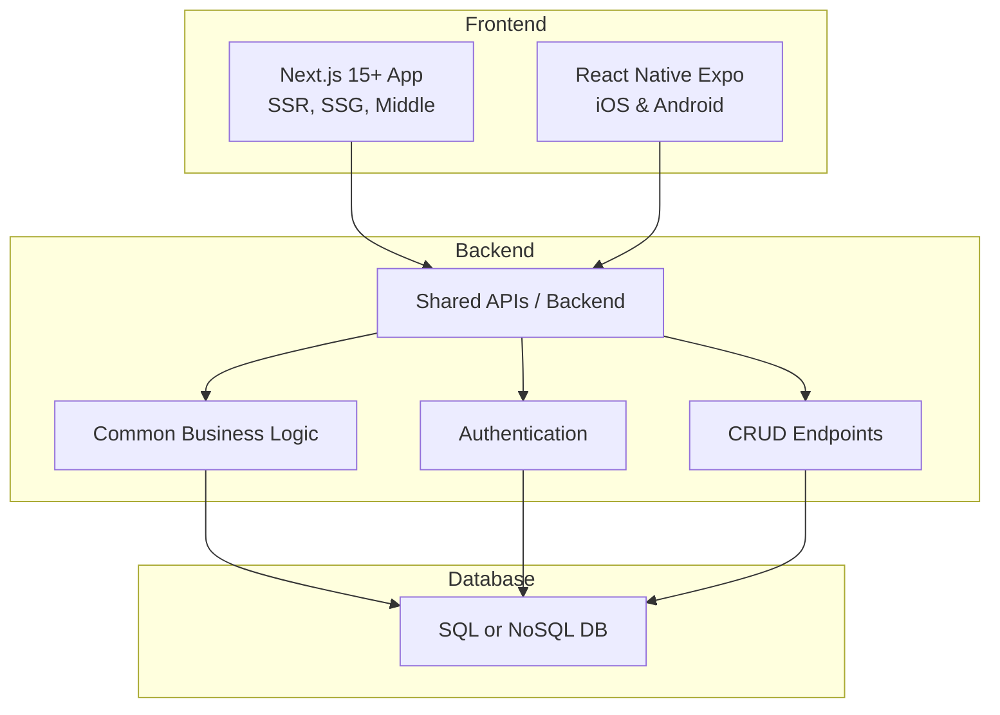

# Haloweave's Full-Stack Web & Mobile Application Execution Plan

**Hello from Haloweave!** We're thrilled to present our proposed plan for executing your educational platform project. This document details how we will build, deploy, and optimize both the **web app (Next.js)** and **mobile apps (React Native with Expo)**, ensuring a consistent user experience across platforms.

---

## 1. Technical Feasibility

### 1.1 Overview
We will develop two main applications for you:
1. **Next.js 15+ Web App**: Server-Side Rendering (SSR) and Static Site Generation (SSG), leveraging built-in middleware.
2. **React Native Mobile Apps (Expo)**: Streamlined builds and easy submissions to both iOS and Android stores.

By utilizing a **shared API** and data architecture, our approach ensures consistent features, design elements, and performance across web, iOS, and Android.

### 1.2 Tech Stack Breakdown

1. **Next.js 15+**  
   - **Rationale**:  
     - SSR and SSG for SEO benefits and enhanced performance.  
     - Middlewares for tasks like authentication and analytics.  
     - Seamless Vercel integration for deployment and scaling.

2. **React Native (Expo)**  
   - **Rationale**:  
     - Faster development cycles with Hot Reloading.  
     - Expo simplifies the integration of native modules.  
     - Cross-platform codebase for iOS and Android.

3. **Backend & APIs**  
   - **Shared RESTful or GraphQL API** for consistent data handling across web and mobile.  
   - Implementation in Node.js/Express, NestJS, or a serverless environment.  
   - **ORM** (e.g., Prisma, Sequelize) to manage database operations.

4. **Database**  
   - **Option 1**: PostgreSQL/MySQL for structured data models.  
   - **Option 2**: MongoDB (NoSQL) for more flexible data handling—especially for Q&A features.

5. **Authentication**  
   - **JWT-based** or **OAuth 2.0**, depending on future third-party service integrations.  
   - Secure token storage: Expo SecureStore on mobile and httpOnly cookies or local storage for the web.

6. **Hosting & Deployment**  
   - **Web**: Vercel for builds, automatic CI/CD, and custom domain hosting.  
   - **Mobile**: Expo build system (EAS) to generate binaries for Google Play Store & Apple App Store.

### 1.3 Architecture Diagram

---

## 2. Implementation Plan

### 2.1 Project Roadmap & Timelines

1. **Discovery & Planning (1 Week)**  
   - Finalize requirements from the Figma design and user stories.  
   - Establish data schema, API contracts, and proof-of-concept for video streaming/Q&A.

2. **UI/UX Design (2 Weeks)**  
   - Convert Figma mockups into responsive designs for web and mobile.  
   - Develop a cohesive design system (colors, typography, etc.).

3. **Development (4 Weeks)**  
   - **Weeks 1–2**:  
     - **Backend**: Set up server (Node.js/Express or NestJS) and database schema, plus core APIs for auth, Q&A, progress tracking.  
     - **Next.js**: Initialize project, configure routes, implement login/signup and initial dashboard.
   - **Weeks 3–4**:  
     - **React Native (Expo)**: Initialize project, set up navigation, replicate dashboard and user flows from web.  
     - Integrate video player libraries, Q&A, and progress tracking in both web and mobile.
   
4. **Testing & Feedback (2 Weeks)**  
   - **Integration Testing**: Verify web and mobile functionality against the shared backend.  
   - **User Testing**: Gather feedback on UI/UX to refine interactions and flows.  
   - **Performance Testing**: Ensure the system can handle expected load for video lessons and Q&A.

5. **Deployment (1 Week)**  
   - **Web**: Deploy to Vercel, configure environments, test SSR and SSG.  
   - **Mobile**: Use Expo's EAS to build and submit to Google Play and Apple App Store.

### 2.2 Development Milestones

1. **Milestone 1: Project Setup**  
   - Initialize Next.js and Expo projects, establish code repositories.  
   - Choose backend framework and configure database connections.

2. **Milestone 2: User Auth & Profile**  
   - Implement login, signup, and logout.  
   - JWT (or session-based) authentication across all platforms.  
   - Basic profile page with edit capabilities.

3. **Milestone 3: Core App Features**  
   - Dashboard tailored to user's grade level.  
   - Video lessons library and streaming setup.  
   - Q&A or comment section beneath each video.

4. **Milestone 4: Progress Tracking & Analytics**  
   - Save/retrieve user progress on each lesson or chapter.  
   - Provide visual indicators (progress bars/checkmarks).

5. **Milestone 5: Testing & Final Adjustments**  
   - Unit and integration tests for web and mobile.  
   - Fine-tuning design to ensure Figma match and cross-platform consistency.  
   - Preparations for store submissions and domain go-live.

---

## 3. Deployment Strategy

### 3.1 Web App (Vercel)
1. **Continuous Deployment**: Connect the Git repository for automated builds and previews.  
2. **Environment Variables**: Securely manage API keys, database URIs, and tokens.  
3. **SSR & Middleware**: Validate SSR performance and ensure middlewares function as intended on Vercel's serverless infrastructure.

### 3.2 Mobile Apps (Expo)
1. **Expo Build/Submit**: Leverage Expo's build service to compile APK (Android) and IPA (iOS) files.  
2. **Google Play Console**:  
   - Configure app details, upload assets (screenshots, icon, description).  
   - Track test builds in internal/alpha/beta channels before production release.
3. **Apple App Store**:  
   - Utilize App Store Connect to manage the iOS release.  
   - Provide necessary metadata (app preview images, compliance info).  
   - Conduct TestFlight beta tests prior to public release.

---

## 4. Optimization Tips

1. **Performance**  
   - **Next.js**: Apply Static Site Generation for less frequently updated content.  
   - **React Native**: Implement image caching, lazy loading of heavy modules, and offload intensive tasks to background threads.
2. **Scalability**  
   - Use modular or microservices architectures for components likely to handle heavy load (video streaming, analytics).  
   - Employ load balancing and auto-scaling for the backend.
3. **Code Organization**  
   - Consider a **monorepo** (Nx, Turborepo) to share code between web and mobile.  
   - Consolidate business logic in shared libraries.
4. **Security**  
   - Enforce HTTPS and secure token storage.  
   - Validate inputs on the server, especially user-submitted Q&A content.  
   - Apply rate-limiting to important endpoints.

---

## 5. Approval Process (App Stores)

### 5.1 Google Play Store
- **Content & Rating**: Ensure educational content meets guidelines for intended age groups.  
- **Privacy Policy**: Clearly posted and linked in the app listing.  
- **Testing & Rollouts**: Conduct internal and external testing to catch issues early.

### 5.2 Apple App Store
- **Human Interface Guidelines**: Comply with layout requirements, safe areas, and gestures.  
- **Privacy & Support**: Fill out all privacy questions accurately and provide a support URL/email.  
- **App Monetization**: If subscriptions or in-app purchases exist, adhere to Apple's payment policies.

---

## 6. Challenges and Solutions

1. **Responsive Design for Diverse Platforms**  
   - **Challenge**: Maintaining pixel-perfect fidelity from Figma across web, tablets, and phones.  
   - **Solution**: Use responsive units and test extensively on multiple devices and screen sizes.

2. **High-Quality Video Streaming & Real-Time Q&A**  
   - **Challenge**: Managing streaming performance and potentially real-time user interactions.  
   - **Solution**: Use a CDN for video hosting; integrate WebSockets or a real-time service (Firebase) for Q&A.

3. **Offline Readiness**  
   - **Challenge**: Ensuring students in low connectivity areas can still access lessons.  
   - **Solution**: Implement caching strategies (AsyncStorage on mobile, localStorage/IndexedDB on web) and sync data when back online.

4. **App Store Submissions**  
   - **Challenge**: Risk of extended review times or rejections.  
   - **Solution**: Strictly follow Apple's and Google's guidelines, including child privacy considerations. Allocate buffer time to handle resubmissions if needed.

5. **Scalability for Growing Educational Content**  
   - **Challenge**: Data volumes and user concurrency may grow significantly.  
   - **Solution**: Design APIs and services to scale horizontally; monitor usage metrics and add resources or microservices as needed.

---

## Conclusion

At Haloweave, we're committed to delivering a **scalable, high-performance educational platform** that aligns perfectly with your vision. Our approach harnesses the flexibility of **Next.js 15+**, **React Native with Expo**, and a **shared API** to unify user experiences across devices. We look forward to partnering with you on this exciting journey and ensuring a successful, on-schedule launch to empower Grades 6–12 with interactive learning.